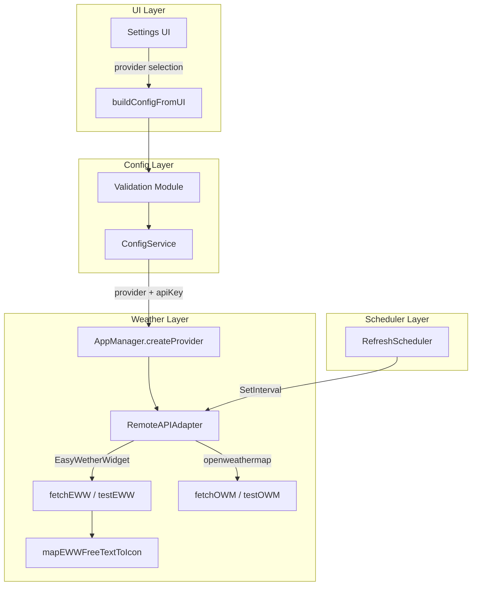

# Design Document: EasyWetherWidget Provider

## Overview

This design adds a second remote API weather provider, "EasyWetherWidget" (EWW), to the WeatherWidget desktop application. The existing architecture already supports multiple providers through the `WeatherProvider` interface and the `RemoteAPIAdapter` struct, which dispatches by provider name. The changes span four layers:

1. **Configuration & Validation** — register `"EasyWetherWidget"` as a valid provider, add provider-dependent refresh interval validation.
2. **Remote API Adapter** — add EWW fetch/test methods, EWW response parsing, and FreeText-to-icon mapping.
3. **Settings UI** — replace the static provider select with a two-option dropdown, wire provider-dependent slider minimum.
4. **Scheduler** — no structural changes; the existing `RefreshScheduler` already supports dynamic interval changes.

The design follows the existing patterns: provider dispatch via `switch` in `RemoteAPIAdapter`, validation via `allowedProviders` map, and property-based testing with `pgregory.net/rapid`.

## Architecture

The feature integrates into the existing layered architecture without introducing new packages or interfaces.



**Key design decision**: Rather than creating a separate adapter struct for EWW, we extend `RemoteAPIAdapter` with new `fetchEWW` and `testEWW` methods, following the same pattern used for OpenWeatherMap and Weather Underground. This keeps the provider dispatch centralized and avoids interface proliferation.

## Components and Interfaces

### 1. Configuration Changes (`internal/config/`)

**`validation.go`** — Extend `allowedProviders` map:
```go
var allowedProviders = map[string]bool{
    "openweathermap":    true,
    "EasyWetherWidget":  true,
}
```

Add provider-dependent refresh interval validation. The current validation enforces `1–60` for all providers. The new logic:
- `"openweathermap"`: minimum 120 minutes (the slider max becomes 120, so effectively the only valid value when OWM is selected is 120).
- `"EasyWetherWidget"`: minimum 30 minutes, maximum 120 minutes.
- When `DataSource` is not `remote_api`, keep the existing `1–60` range.

The `Validate` function will check `cfg.APIConfig.Provider` to determine which interval range applies.

**`types.go`** — No structural changes. The existing `APIConfig.Provider` field already stores the provider string.

**`config_property_test.go`** — Update the `providers` slice to include `"EasyWetherWidget"`. Update `genConfig` to generate provider-appropriate refresh intervals.

### 2. Remote API Adapter Changes (`internal/weather/remoteapi/adapter.go`)

**New constant**:
```go
const defaultEWWBaseURL = "https://wagemaker.uk:8043"
```

**`NewRemoteAPIAdapter`** — Add `"EasyWetherWidget"` case to set `BaseURL` to `defaultEWWBaseURL`.

**`FetchWeather`** — Add `case "EasyWetherWidget": return r.fetchEWW(ctx, city)`.

**`TestConnection`** — Add `case "EasyWetherWidget": return r.testEWW(ctx)`.

**New EWW response struct**:
```go
type ewwResponse struct {
    Temp         float64 `json:"Temp"`
    Neighborhood string  `json:"Neighborhood"`
    Country      string  `json:"Country"`
    FreeText     string  `json:"FreeText"`
    ObsTimeLocal string  `json:"ObsTimeLocal"`
}
```

**`fetchEWW`** — Constructs URL as `{BaseURL}/api/v1/weather/key={apiKey}/{cityName},{countryCode}`, parses the JSON response, maps `FreeText` to icon code, rounds `Temp` to nearest integer, and returns a `WeatherData` struct.

**`testEWW`** — Makes a lightweight request to the EWW API using a known city (e.g., `London,GB`). Returns `"invalid API key"` on HTTP 401, descriptive connection error on network failure.

**`mapEWWFreeTextToIcon`** — New function performing case-insensitive keyword matching:

```go
func mapEWWFreeTextToIcon(freeText string) string {
    lower := strings.ToLower(freeText)
    switch {
    case strings.Contains(lower, "storm"), strings.Contains(lower, "thunder"):
        return weather.IconStorm
    case strings.Contains(lower, "snow"):
        return weather.IconSnow
    case strings.Contains(lower, "rain"), strings.Contains(lower, "drizzle"):
        return weather.IconRain
    case strings.Contains(lower, "fog"), strings.Contains(lower, "mist"), strings.Contains(lower, "haze"):
        return weather.IconFog
    case strings.Contains(lower, "cloud"):
        return weather.IconCloudy
    case strings.Contains(lower, "clear"):
        return weather.IconClear
    default:
        return weather.IconPartlyCloudy
    }
}
```

**Keyword priority**: Storm/thunder is checked before rain/cloud to handle strings like "thunderstorm" correctly. Snow is checked before rain to handle "snow showers". The order matters for overlapping keywords.

### 3. Settings UI Changes (`internal/ui/settings.go`)

**Provider dropdown** — Replace the current `widget.NewSelect([]string{"OpenWeatherMap"}, nil)` with:
```go
providerSelect := widget.NewSelect(
    []string{"OpenWeatherMap (Free)", "EasyWetherWidget (Pro)"},
    nil,
)
```

**Display-to-value mapping**:
```go
var providerDisplayToValue = map[string]string{
    "OpenWeatherMap (Free)":   "openweathermap",
    "EasyWetherWidget (Pro)":  "EasyWetherWidget",
}
var providerValueToDisplay = map[string]string{
    "openweathermap":   "OpenWeatherMap (Free)",
    "EasyWetherWidget": "EasyWetherWidget (Pro)",
}
```

**Interval slider adjustment** — On provider change:
```go
providerSelect.OnChanged = func(selected string) {
    switch providerDisplayToValue[selected] {
    case "openweathermap":
        intervalSlider.Min = 120
        intervalSlider.Max = 120
        intervalSlider.SetValue(120)
    case "EasyWetherWidget":
        intervalSlider.Min = 30
        intervalSlider.Max = 120
        if intervalSlider.Value < 30 {
            intervalSlider.SetValue(30)
        }
    }
    intervalLabel.SetText(fmt.Sprintf("%d min", int(intervalSlider.Value)))
}
```

**Initial state** — When the settings dialog opens, set the provider dropdown to the current config value and apply the corresponding slider constraints.

**`buildConfigFromUI`** — Use `providerDisplayToValue` to convert the selected display string to the stored provider value.

### 4. AppManager Changes (`internal/app/manager.go`)

**`createProvider`** — The existing code already passes `cfg.APIConfig.Provider` to `NewRemoteAPIAdapter`, so no changes needed here. The adapter's constructor will handle the new provider.

## Data Models

### EWW API Response

| JSON Field     | Go Type  | Maps To                    |
|----------------|----------|----------------------------|
| `Temp`         | float64  | `WeatherData.Temperature` (rounded to int) |
| `Neighborhood` | string   | `WeatherData.CityName`     |
| `Country`      | string   | `WeatherData.Region`       |
| `FreeText`     | string   | `WeatherData.Description` + icon mapping |
| `ObsTimeLocal` | string   | `WeatherData.LocalTime` (parsed) |

### Provider-Dependent Validation Rules

| Provider           | Min Interval | Max Interval |
|--------------------|-------------|-------------|
| `openweathermap`   | 120 min     | 120 min     |
| `EasyWetherWidget` | 30 min      | 120 min     |
| (non-API source)   | 1 min       | 60 min      |

### Existing Data Model (unchanged)

The `WeatherData` struct, `WeatherProvider` interface, `Config` struct, and `APIConfig` struct remain unchanged. The new provider value `"EasyWetherWidget"` is stored in the existing `APIConfig.Provider` field.


## Correctness Properties

*A property is a characteristic or behavior that should hold true across all valid executions of a system — essentially, a formal statement about what the system should do. Properties serve as the bridge between human-readable specifications and machine-verifiable correctness guarantees.*

### Property 1: EWW Response Parsing Consistency

*For any* valid EWW API JSON response (with arbitrary `Temp` float, `Neighborhood` string, `Country` string, `FreeText` string, and `ObsTimeLocal` string), parsing the response through `fetchEWW` SHALL produce a `WeatherData` struct where:
- `Temperature` equals `int(math.Round(Temp))`
- `CityName` equals the city name from the request (not `Neighborhood`, since the existing OWM pattern uses `city.Name`)
- `Region` equals the city region from the request (consistent with OWM pattern)
- `Description` equals the `FreeText` value
- `IconCode` is a member of `AllIconCodes`

**Validates: Requirements 2.2, 2.3, 2.4, 2.5, 2.6, 2.7, 7.1, 7.3**

### Property 2: FreeText-to-Icon Totality

*For any* arbitrary string input, `mapEWWFreeTextToIcon` SHALL return a value that is a member of `AllIconCodes` (one of the seven defined icon constants: clear, partly_cloudy, cloudy, rain, snow, storm, fog).

**Validates: Requirements 2.6, 7.2**

### Property 3: FreeText Keyword Mapping Correctness

*For any* string containing a target keyword and no higher-priority keywords:
- Strings containing "storm" or "thunder" → `storm`
- Strings containing "snow" (without storm/thunder) → `snow`
- Strings containing "rain" or "drizzle" (without storm/thunder/snow) → `rain`
- Strings containing "fog", "mist", or "haze" (without storm/thunder/snow/rain/drizzle) → `fog`
- Strings containing "cloud" (without any of the above) → `cloudy`
- Strings containing "clear" (without any of the above) → `clear`
- Strings containing none of the above keywords → `partly_cloudy`

**Validates: Requirements 3.1, 3.2, 3.3, 3.4, 3.5, 3.6, 3.7**

### Property 4: FreeText Case-Insensitive Matching

*For any* string `s`, `mapEWWFreeTextToIcon(s)` SHALL equal `mapEWWFreeTextToIcon(strings.ToUpper(s))` and `mapEWWFreeTextToIcon(strings.ToLower(s))`. The icon mapping is invariant under case transformation.

**Validates: Requirements 3.8**

### Property 5: Provider-Dependent Interval Validation

*For any* config with `DataSource = remote_api` and a valid `APIConfig`:
- When `Provider` is `"openweathermap"` and `RefreshInterval` is less than 120, `Validate` SHALL return an error for the `refreshInterval` field.
- When `Provider` is `"EasyWetherWidget"` and `RefreshInterval` is less than 30, `Validate` SHALL return an error for the `refreshInterval` field.
- When `Provider` is `"EasyWetherWidget"` and `RefreshInterval` is between 30 and 120 (inclusive), `Validate` SHALL NOT return an error for the `refreshInterval` field.

**Validates: Requirements 6.6, 6.7**

### Existing Properties (Updated)

The following existing property tests require generator updates but no new property definitions:

- **Existing Property 1 (Config Serialization Round-Trip)**: Update the `providers` generator to include `"EasyWetherWidget"`. Update `genConfig` to generate provider-appropriate refresh intervals. This ensures the new provider value survives save/load. **Validates: Requirement 1.2**
- **Existing Property 2 (Validation Correctness)**: Update the `providers` generator and refresh interval generator to account for provider-dependent minimums. This ensures validation correctly accepts/rejects the new provider. **Validates: Requirements 1.1, 1.3**

## Error Handling

### EWW API Errors

| Condition | Behavior |
|-----------|----------|
| HTTP 401 (Unauthorized) | Return `"invalid API key"` error |
| HTTP non-200 (other) | Return `"EWW API error (status {code}): {body}"` |
| Network error (timeout, DNS, etc.) | Return `"execute request: {underlying error}"` |
| Malformed JSON response | Return `"parse EWW response: {underlying error}"` |
| Missing required fields | Return parsed struct with zero values (Go default behavior) |

### Validation Errors

| Condition | Error Field | Message |
|-----------|-------------|---------|
| Provider is `"EasyWetherWidget"` with empty API key | `apiConfig.apiKey` | `"must not be empty"` |
| Refresh interval < 120 with OWM provider | `refreshInterval` | `"must be at least 120 for openweathermap"` |
| Refresh interval < 30 with EWW provider | `refreshInterval` | `"must be at least 30 for EasyWetherWidget"` |
| Refresh interval > 120 | `refreshInterval` | `"must be at most 120"` |

### Settings UI Error Handling

- Connection test failure: displayed via `dialog.ShowError` with the error message from `TestConnection`.
- Validation failure: displayed via `dialog.ShowError` with concatenated validation error messages (existing pattern).

## Testing Strategy

### Property-Based Tests (pgregory.net/rapid)

The project already uses `pgregory.net/rapid` for property-based testing. All new property tests follow the existing conventions.

| Property | Test File | Min Iterations |
|----------|-----------|---------------|
| Property 1: EWW Response Parsing Consistency | `internal/weather/remoteapi/adapter_property_test.go` | 100 |
| Property 2: FreeText-to-Icon Totality | `internal/weather/remoteapi/adapter_property_test.go` | 100 |
| Property 3: FreeText Keyword Mapping Correctness | `internal/weather/remoteapi/adapter_property_test.go` | 100 |
| Property 4: FreeText Case-Insensitive Matching | `internal/weather/remoteapi/adapter_property_test.go` | 100 |
| Property 5: Provider-Dependent Interval Validation | `internal/config/validation_property_test.go` | 100 |
| Existing Property 1 (updated generators) | `internal/config/config_property_test.go` | 100 |
| Existing Property 2 (updated generators) | `internal/config/validation_property_test.go` | 100 |

Each property test must be tagged with:
```
// **Feature: easy-wether-widget-provider, Property {N}: {title}**
// **Validates: Requirements X.Y**
```

Each property test must run a minimum of 100 iterations (rapid's default is 100, which satisfies this).

### Unit Tests (Example-Based)

| Test | File | Covers |
|------|------|--------|
| EWW URL construction | `internal/weather/remoteapi/adapter_test.go` | Req 2.1 |
| EWW fetch success (mock server) | `internal/weather/remoteapi/adapter_test.go` | Req 2.2–2.7 |
| EWW fetch non-200 error | `internal/weather/remoteapi/adapter_test.go` | Req 2.8 |
| EWW fetch malformed JSON | `internal/weather/remoteapi/adapter_test.go` | Req 2.9 |
| EWW test connection success | `internal/weather/remoteapi/adapter_test.go` | Req 4.1 |
| EWW test connection 401 | `internal/weather/remoteapi/adapter_test.go` | Req 4.2 |
| EWW test connection network error | `internal/weather/remoteapi/adapter_test.go` | Req 4.3 |
| Validation accepts "EasyWetherWidget" | `internal/config/validation_test.go` | Req 1.1 |
| Provider display-to-value mapping | `internal/ui/settings_test.go` | Req 5.2, 5.3 |

### What Is NOT Tested with PBT

- **UI rendering** (Req 5.1, 5.4, 6.1–6.5): These are Fyne UI interactions that require the UI toolkit. Tested with example-based unit tests or manual verification.
- **Network integration** (Req 4.1–4.3): Real API calls are tested with mock HTTP servers, not PBT.
- **URL construction** (Req 2.1): Specific format verification, not a universal property.
