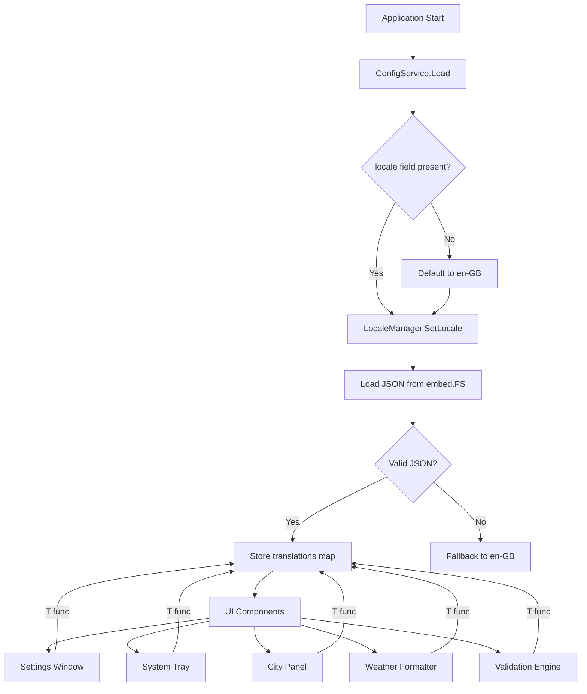
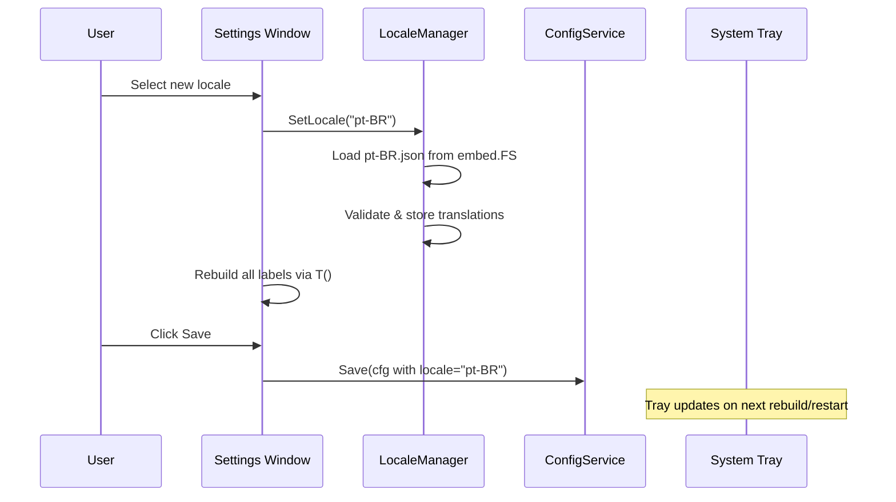

# Design Document: i18n Localization

## Overview

This design adds internationalisation (i18n) and localisation (l10n) to the WeatherWidget desktop application. The approach introduces a lightweight `LocaleManager` that loads flat JSON translation files embedded in the binary via Go's `embed.FS`. All human-readable strings across the widget display, settings window, system tray menu, weather formatting, and validation/error messages are replaced with keyed lookups through the `LocaleManager`.

The initial supported locales are **en-GB** (default) and **pt-BR**. The architecture is designed so adding a new locale requires only dropping a new JSON file into the embedded assets directory — no code changes.

### Key Design Decisions

1. **Flat JSON files over nested structures** — Flat `"section.key": "value"` maps are simpler to parse, validate, and diff. No need for recursive traversal.
2. **Custom lightweight manager over external libraries** — The project's needs are simple (key→string lookup, fallback, completeness check). A ~100-line `LocaleManager` avoids adding a dependency for what amounts to a `map[string]string` lookup. The project already has `golang.org/x/text` as a transitive dep but doesn't need its full message catalog machinery.
3. **Embedded files via `embed.FS`** — Consistent with the existing `assets/embed.go` pattern. Locale files ship inside the binary, no filesystem access needed at runtime.
4. **en-GB as the fallback locale** — Every key must exist in en-GB. Any missing key in another locale silently falls back to en-GB, ensuring the UI never shows a raw message key.

## Architecture



The `LocaleManager` is a singleton-style component created at application startup and passed (or accessible) to all UI and formatting components. Each component calls `lm.T("message.key")` to get the translated string.

### Locale Switching Flow



## Components and Interfaces

### 1. LocaleManager (`internal/i18n/locale.go`)

The central translation component.

```go
package i18n

import "embed"

// LocaleManager loads and serves translated strings.
type LocaleManager struct {
    fs           embed.FS        // embedded locale files
    defaultLang  string          // "en-GB"
    activeLang   string          // current locale
    translations map[string]string // active locale translations
    fallback     map[string]string // en-GB translations (always loaded)
    available    []LocaleInfo     // discovered locales
}

// LocaleInfo describes an available locale.
type LocaleInfo struct {
    Code        string // e.g. "en-GB", "pt-BR"
    DisplayName string // e.g. "English (UK)", "Português (Brasil)"
}

// NewLocaleManager creates a manager from the embedded FS.
func NewLocaleManager(fs embed.FS) (*LocaleManager, error)

// SetLocale switches the active locale. Falls back to en-GB on error.
func (lm *LocaleManager) SetLocale(code string) error

// T returns the translated string for the given key.
// Falls back to en-GB if the key is missing in the active locale.
// Returns the key itself if not found in either locale.
func (lm *LocaleManager) T(key string) string

// TWithArgs returns a translated string with fmt.Sprintf-style arguments.
func (lm *LocaleManager) TWithArgs(key string, args ...interface{}) string

// ActiveLocale returns the current locale code.
func (lm *LocaleManager) ActiveLocale() string

// AvailableLocales returns all discovered locale codes with display names.
func (lm *LocaleManager) AvailableLocales() []LocaleInfo

// MissingKeys compares a locale against en-GB and returns missing keys.
func (lm *LocaleManager) MissingKeys(localeCode string) ([]string, error)

// ValidateLocaleFile checks if a JSON byte slice is a valid locale file.
// Returns an error if JSON is invalid or contains issues.
func ValidateLocaleFile(data []byte) (map[string]string, error)
```

### 2. Locale Files (`internal/i18n/locales/`)

Embedded JSON files with flat key-value structure:

```
internal/i18n/locales/
├── en-GB.json
└── pt-BR.json
```

Each file follows this structure:

```json
{
  "_locale.code": "en-GB",
  "_locale.displayName": "English (UK)",
  "settings.title": "WeatherWidget Settings",
  "settings.tab.appearance": "Appearance",
  "settings.tab.provider": "Data Provider",
  "settings.tab.locations": "Locations",
  "settings.tab.about": "About",
  "settings.position.title": "Widget Position",
  "settings.position.subtitle": "Where should the widget appear?",
  "settings.position.topLeft": "Top-Left",
  "settings.position.topRight": "Top-Right",
  "settings.position.bottomLeft": "Bottom-Left",
  "settings.position.bottomRight": "Bottom-Right",
  "settings.transparency.title": "Background Transparency",
  "settings.transparency.subtitle": "Adjust how see-through the widget is.",
  "settings.interval.title": "Refresh Interval",
  "settings.interval.subtitle": "How often to fetch new data.",
  "settings.interval.format": "%d min",
  "settings.startup.title": "Startup",
  "settings.startup.subtitle": "Start automatically when you log in.",
  "settings.startup.autostart": "Launch WeatherWidget when Windows starts",
  "settings.provider.title": "Data Provider & API Key",
  "settings.provider.subtitle": "Configure the weather data source.",
  "settings.provider.label": "Provider",
  "settings.provider.apiKeyLabel": "API Key",
  "settings.provider.apiKeyPlaceholder": "API Key",
  "settings.provider.getFreeApi": "Get FREE API",
  "settings.provider.getProApi": "Get PRO API",
  "settings.provider.note": "Note: \nFree = 120 minutes refresh rate (limited). \nPro = 10 minutes refresh rate (unlimited).",
  "settings.locations.savedTitle": "Saved Cities",
  "settings.locations.savedSubtitle": "Manage your tracked locations (1–5 cities).",
  "settings.locations.addTitle": "Add New City",
  "settings.locations.namePlaceholder": "City name",
  "settings.locations.regionPlaceholder": "Region / Country (e.g. BR)",
  "settings.locations.latPlaceholder": "Latitude (optional)",
  "settings.locations.lonPlaceholder": "Longitude (optional)",
  "settings.locations.tzPlaceholder": "Timezone (America/Sao_Paulo)",
  "settings.locations.addBtn": "Add City",
  "settings.locations.searchBtn": "Search API",
  "settings.locations.searching": "Searching...",
  "settings.locations.removeBtn": "Remove",
  "settings.locations.nameLabel": "Name",
  "settings.locations.regionLabel": "Region",
  "settings.locations.latLabel": "Latitude",
  "settings.locations.lonLabel": "Longitude",
  "settings.locations.tzLabel": "Timezone",
  "settings.monitor.label": "Display Monitor",
  "settings.monitor.format": "Monitor %d",
  "settings.save": "Save",
  "settings.dialog.saved": "Saved",
  "settings.dialog.savedMsg": "Settings saved successfully!",
  "settings.about.version": "**Version:** 0.0.6.0",
  "settings.about.description": "A compact, transparent time & weather widget that lives on your desktop.\nMonitor up to 5 cities at a glance with a beautiful, always-on-top overlay.",
  "settings.about.websiteLabel": "Website:",
  "settings.about.previewLabel": "Preview",
  "settings.about.appName": "WeatherWidget",
  "settings.language.title": "Language",
  "settings.language.subtitle": "Choose your preferred language.",
  "tray.showWidget": "Show Widget",
  "tray.hideWidget": "Hide Widget",
  "tray.settings": "Settings",
  "tray.quit": "Quit",
  "panel.placeholder.city": "City, RG",
  "panel.placeholder.temp": "--°C",
  "panel.placeholder.desc": "--",
  "panel.placeholder.time": "--:--:--",
  "panel.placeholder.date": "--/--/----",
  "panel.staleWarning": "Data may be stale",
  "weather.tempSuffix": "°C",
  "weather.tempFormat": "%d°C",
  "weather.dateFormat": "02/01/2006",
  "weather.timeFormat": "15:04:05",
  "validation.cities.count": "must contain 1 to 5 cities, got %d",
  "validation.refreshInterval.min.owm": "must be at least 120 for openweathermap",
  "validation.refreshInterval.min.eww": "must be at least 10 for easyweatherwidget",
  "validation.refreshInterval.max": "must be at most 120",
  "validation.refreshInterval.range": "must be between 1 and 60, got %d",
  "validation.cornerPosition.invalid": "must be one of top-left, top-right, bottom-left, bottom-right, got %q",
  "validation.apiConfig.required": "required when dataSource is remote_api",
  "validation.apiConfig.apiKey.empty": "must not be empty",
  "validation.apiConfig.provider.invalid": "must be openweathermap or easyweatherwidget, got %q",
  "validation.dbConfig.required": "required when dataSource is local_database",
  "validation.dbConfig.host.empty": "must not be empty",
  "validation.dbConfig.port.range": "must be between 1 and 65535, got %d",
  "validation.dbConfig.dbName.empty": "must not be empty",
  "validation.dbConfig.username.empty": "must not be empty",
  "validation.city.name.empty": "must not be empty",
  "validation.city.lat.range": "must be between -90 and 90, got %v",
  "validation.city.lon.range": "must be between -180 and 180, got %v",
  "validation.locale.invalid": "must be a supported locale, got %q",
  "error.cities.max": "maximum of 5 cities reached",
  "error.cities.removeLast": "cannot remove the last city",
  "error.cities.indexOutOfBounds": "index %d out of bounds for city list of length %d",
  "error.settings.cityNameRequired": "city name is required",
  "error.settings.cityNameRequiredSearch": "city name is required to search",
  "error.settings.apiKeyRequired": "API Key is required in the settings above to search",
  "error.settings.regionRequiredEww": "Region / Country is required to search via EasyWeatherWidget",
  "error.settings.invalidLat": "invalid latitude: %v",
  "error.settings.invalidLon": "invalid longitude: %v",
  "error.settings.searchFailed": "search failed: %v",
  "error.settings.searchApiError": "search API error: %d",
  "error.settings.readError": "read error: %v",
  "error.settings.parseFailed": "failed to parse search response: %v",
  "error.settings.noCityFound": "no city found matching '%s'",
  "error.settings.connectionFailed": "connection test failed: %v",
  "error.settings.saveFailed": "failed to save config: %v",
  "error.settings.autoStartFailed": "failed to update auto-start: %v"
}
```

### 3. Embed File (`internal/i18n/embed.go`)

```go
package i18n

import "embed"

//go:embed locales/*.json
var LocaleFS embed.FS
```

### 4. Config Changes (`internal/config/types.go`)

Add `Locale` field to `Config`:

```go
type Config struct {
    // ... existing fields ...
    Locale string `json:"locale"` // e.g. "en-GB", "pt-BR"
}
```

`DefaultConfig()` sets `Locale: "en-GB"`.

### 5. Modified Components

| Component | File | Changes |
|-----------|------|---------|
| `ConfigService` | `internal/config/service.go` | Load/save `locale` field; default to `"en-GB"` if missing |
| `Validation` | `internal/config/validation.go` | Validate `locale` against available locales; use `LocaleManager.TWithArgs` for error messages |
| `Cities` | `internal/config/cities.go` | Use `LocaleManager.T` for error messages |
| `UIManager` | `internal/ui/manager.go` | Accept and store `*LocaleManager` reference |
| `Settings` | `internal/ui/settings.go` | Replace all hardcoded strings with `lm.T()` calls; add language selector to Appearance tab |
| `Tray` | `internal/ui/tray.go` | Replace hardcoded menu labels with `lm.T()` calls |
| `CityPanel` | `internal/ui/panel/panel.go` | Replace hardcoded placeholder text and stale warning with `lm.T()` calls |
| `WeatherFormatter` | `internal/weather/format.go` | Accept locale-aware format strings for temperature, date, time |
| `AppManager` | `internal/app/manager.go` | Create `LocaleManager` at startup; pass to UI and formatting components |

## Data Models

### Locale File Schema

Each locale file is a flat JSON object:

```
{
  "_locale.code": string,        // Required. IETF language tag (e.g. "en-GB")
  "_locale.displayName": string,  // Required. Human-readable name (e.g. "English (UK)")
  "<message.key>": string         // Translation string, may contain %d/%s/%v fmt verbs
}
```

**Constraints:**
- All keys must be non-empty strings
- All values must be strings
- `_locale.code` and `_locale.displayName` are required metadata keys
- No duplicate keys (enforced by custom JSON decoder)
- en-GB is the reference locale; all other locales should contain at least all keys present in en-GB

### Config Schema Addition

```json
{
  "locale": "en-GB"
}
```

- Type: `string`
- Default: `"en-GB"`
- Validation: must match one of the available locale codes discovered from embedded files

## Correctness Properties

*A property is a characteristic or behavior that should hold true across all valid executions of a system — essentially, a formal statement about what the system should do. Properties serve as the bridge between human-readable specifications and machine-verifiable correctness guarantees.*

### Property 1: Lookup returns translated string for valid keys

*For any* valid message key that exists in the en-GB locale file, calling `T(key)` on a `LocaleManager` with any active locale SHALL return a non-empty string.

**Validates: Requirements 1.4**

### Property 2: Missing key fallback to en-GB

*For any* locale file that is a subset of en-GB keys, and *for any* key present in en-GB but missing from the active locale, calling `T(key)` SHALL return the en-GB translation for that key.

**Validates: Requirements 1.5**

### Property 3: Locale validation accepts valid and rejects invalid

*For any* string, the locale validation function SHALL return no error if and only if the string matches one of the available locale codes. For any string that does not match, it SHALL produce a validation error.

**Validates: Requirements 3.4, 3.5**

### Property 4: Locale-aware formatting preserves structure

*For any* integer temperature and *any* supported locale, `FormatTemperature(temp, locale)` SHALL produce a string containing the locale's temperature suffix. *For any* valid `time.Time` and *any* supported locale, `FormatDate` and `FormatTime` SHALL produce strings matching the locale's date/time format pattern.

**Validates: Requirements 6.1, 6.2, 6.3**

### Property 5: Locale file JSON round-trip

*For any* valid locale file (map of string keys to string values), serialising to JSON then deserialising SHALL produce an equivalent map with identical keys and values.

**Validates: Requirements 8.1**

### Property 6: Missing keys detection returns correct set difference

*For any* locale file that is a subset of en-GB keys, the `MissingKeys` function SHALL return exactly the set of keys present in en-GB but absent from the given locale file.

**Validates: Requirements 9.1**

### Property 7: Translated validation errors

*For any* invalid configuration and *any* supported locale, the validation engine SHALL produce error messages that are non-empty strings from the active locale's translations (not raw message keys).

**Validates: Requirements 7.1**

## Error Handling

| Scenario | Handling |
|----------|----------|
| Missing locale file for active locale | Fall back to en-GB; log warning |
| Corrupt/invalid JSON in locale file | Fall back to en-GB; log error |
| Missing message key in active locale | Return en-GB translation for that key |
| Missing message key in both locales | Return the raw key string (developer signal) |
| Invalid `locale` config value | Validation error; `ConfigService.Load` defaults to en-GB |
| Missing `locale` field in config JSON | Default to `"en-GB"` |
| Duplicate keys in locale JSON | Reject file; fall back to en-GB |

## Testing Strategy

### Property-Based Tests (using `pgregory.net/rapid`)

The project already uses `rapid` for property-based testing. Each property test runs a minimum of 100 iterations.

| Property | Test File | What It Tests |
|----------|-----------|---------------|
| Property 1: Lookup valid keys | `internal/i18n/locale_property_test.go` | Random valid keys always return non-empty strings |
| Property 2: Missing key fallback | `internal/i18n/locale_property_test.go` | Keys removed from active locale fall back to en-GB |
| Property 3: Locale validation | `internal/config/validation_property_test.go` | Random strings correctly accepted/rejected as locale values |
| Property 4: Locale-aware formatting | `internal/weather/format_property_test.go` | Random temps/times formatted correctly per locale |
| Property 5: JSON round-trip | `internal/i18n/locale_property_test.go` | Random locale maps survive marshal/unmarshal |
| Property 6: Missing keys detection | `internal/i18n/locale_property_test.go` | Random subsets produce correct missing key lists |
| Property 7: Translated validation errors | `internal/config/validation_property_test.go` | Random invalid configs produce translated error strings |

**Tag format:** `Feature: i18n-localization, Property N: <property text>`

### Unit Tests (example-based)

| Test | File | What It Tests |
|------|------|---------------|
| en-GB completeness | `internal/i18n/locale_test.go` | en-GB file contains all expected message keys |
| pt-BR completeness | `internal/i18n/locale_test.go` | pt-BR file contains all en-GB keys |
| Default locale on missing config | `internal/config/service_test.go` | Config without `locale` field defaults to en-GB |
| Corrupt locale fallback | `internal/i18n/locale_test.go` | Invalid JSON triggers en-GB fallback |
| Locale switch without restart | `internal/i18n/locale_test.go` | `SetLocale` swaps translations in-place |
| Tray menu labels | `internal/ui/tray_test.go` | Menu items use translated strings |
| Settings labels | `internal/ui/settings_test.go` | Settings UI uses translated strings |

### Integration Tests

| Test | What It Tests |
|------|---------------|
| Full app startup with locale | App starts, loads config locale, displays translated UI |
| Locale change round-trip | Change locale in settings → save → restart → verify persisted |
