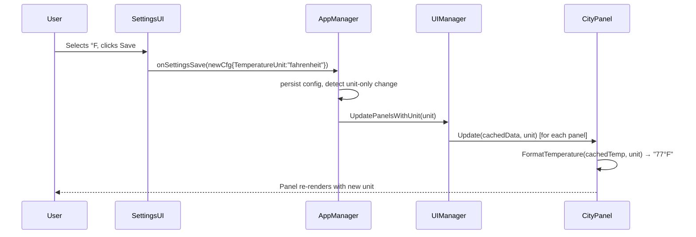

# Design Document: Temperature Unit Toggle

## Overview

This feature adds a user-selectable temperature unit (Celsius / Fahrenheit) to WeatherWidget. The selected unit is persisted in `config.json`, exposed in the Settings UI Appearance tab, and propagated through the rendering pipeline so every city panel displays temperatures in the chosen unit. When the user changes the unit in Settings and saves, all panels re-render immediately using their cached `WeatherData` — no new network fetch is triggered.

The change touches four layers:

| Layer | File | Change |
|---|---|---|
| Config | `internal/config/types.go` | New `TemperatureUnit` type + field |
| Formatting | `internal/weather/format.go` | Updated `FormatTemperature` signature |
| Panel | `internal/ui/panel/panel.go` | Cache last `WeatherData`; accept unit in `Update` |
| Settings UI | `internal/ui/settings.go` | Radio group in Appearance tab; pass unit through save |
| Orchestration | `internal/app/manager.go` | Re-render from cache on unit change; skip `FetchNow` |

---

## Architecture

The data flow for a unit change is:



The key design decision is that `AppManager.onSettingsSave` detects when **only** the temperature unit changed (no provider/city/credential change) and calls a new `UIManager.UpdatePanelsWithUnit` path that uses each panel's cached `WeatherData` instead of calling `scheduler.FetchNow()`.

---

## Components and Interfaces

### 1. `TemperatureUnit` type — `internal/config/types.go`

```go
// TemperatureUnit represents the display unit for temperature values.
type TemperatureUnit string

const (
    TemperatureUnitCelsius    TemperatureUnit = "celsius"
    TemperatureUnitFahrenheit TemperatureUnit = "fahrenheit"
)

// NormalizeTemperatureUnit returns the unit unchanged if it is a known value,
// otherwise returns TemperatureUnitCelsius as the safe default.
func NormalizeTemperatureUnit(u TemperatureUnit) TemperatureUnit {
    switch u {
    case TemperatureUnitCelsius, TemperatureUnitFahrenheit:
        return u
    default:
        return TemperatureUnitCelsius
    }
}
```

The `Config` struct gains one new field:

```go
type Config struct {
    // ... existing fields ...
    TemperatureUnit TemperatureUnit `json:"temperatureUnit,omitempty"`
}
```

Using `omitempty` means existing `config.json` files without the field deserialize to the zero value `""`, which `NormalizeTemperatureUnit` maps to `"celsius"`. `DefaultConfig()` is updated to set `TemperatureUnit: TemperatureUnitCelsius` explicitly.

Config loading calls `NormalizeTemperatureUnit` on the loaded value so invalid persisted values are silently corrected.

---

### 2. `FormatTemperature` — `internal/weather/format.go`

The current signature:

```go
func FormatTemperature(temp int, lm *i18n.LocaleManager) string
```

is replaced with:

```go
// FormatTemperature returns a temperature string for the given Celsius value
// formatted according to unit. Invalid unit values default to Celsius.
func FormatTemperature(temp int, unit config.TemperatureUnit) string {
    switch NormalizeTemperatureUnit(unit) {
    case config.TemperatureUnitFahrenheit:
        f := convertToFahrenheit(temp)
        return fmt.Sprintf("%d°F", f)
    default: // celsius and any invalid value
        return fmt.Sprintf("%d°C", temp)
    }
}

// convertToFahrenheit converts an integer Celsius value to Fahrenheit
// using the formula F = round(C × 1.8 + 32).
func convertToFahrenheit(celsius int) int {
    return int(math.Round(float64(celsius)*1.8 + 32))
}
```

**Rationale for removing `lm` parameter**: The locale manager was used to look up a format string like `"%d°C"`. With explicit unit support the format is now determined by the `unit` parameter, not the locale. Locale-specific number formatting (e.g. comma vs period) is not applicable here since temperatures are always rendered as plain integers. Removing `lm` simplifies the signature and eliminates an implicit dependency.

All call sites that currently pass `lm` are updated to pass the unit from the active config instead.

---

### 3. `CityPanel` — `internal/ui/panel/panel.go`

#### 3a. Cached weather data

`CityPanel` gains a private field to hold the last received data:

```go
type CityPanel struct {
    // ... existing fields ...
    lastData *weather.WeatherData // cached for re-render on unit change
}
```

#### 3b. Updated `Update` signature

```go
// Update sets the panel content from the given weather data using the specified unit.
func (p *CityPanel) Update(data *weather.WeatherData, unit config.TemperatureUnit) {
    if data == nil {
        return
    }
    p.lastData = data  // cache for re-render

    iconCode := weather.MapConditionToIcon(data.IconCode, data.LocalTime)
    res := loadIconFromAssets(iconCode)
    if res != nil {
        p.iconWidget.Resource = res
        p.iconWidget.Refresh()
    }

    p.tempText.Text = weather.FormatTemperature(data.Temperature, unit)
    p.tempText.Refresh()
    p.descLabel.SetText(weather.FormatDescription(data.Description))
    p.cityText.Text = weather.FormatCityRegion(data.CityName, data.Region)
    p.cityText.Refresh()
    p.errorIcon.Hide()
}
```

#### 3c. New `Rerender` method

```go
// Rerender re-applies the last cached WeatherData with a new unit.
// If no data has been cached yet, this is a no-op.
func (p *CityPanel) Rerender(unit config.TemperatureUnit) {
    if p.lastData == nil {
        return
    }
    p.Update(p.lastData, unit)
}
```

---

### 4. Settings UI — `internal/ui/settings.go`

#### 4a. `settingsState` extension

```go
type settingsState struct {
    cities          []config.CityConfig
    window          fyne.Window
    selectedLang    string
    selectedUnit    config.TemperatureUnit // new
}
```

#### 4b. Radio group in Appearance tab

Inside `buildSettingsUI`, a new radio group is added to the Appearance tab content, placed after the transparency section:

```go
// ── Temperature unit ─────────────────────────────────────────────────
unitCelsiusLabel    := "°C (Celsius)"
unitFahrenheitLabel := "°F (Fahrenheit)"

unitValueMap := map[string]config.TemperatureUnit{
    unitCelsiusLabel:    config.TemperatureUnitCelsius,
    unitFahrenheitLabel: config.TemperatureUnitFahrenheit,
}
unitLabelMap := map[config.TemperatureUnit]string{
    config.TemperatureUnitCelsius:    unitCelsiusLabel,
    config.TemperatureUnitFahrenheit: unitFahrenheitLabel,
}

unitRadio := widget.NewRadioGroup(
    []string{unitCelsiusLabel, unitFahrenheitLabel},
    func(selected string) {
        state.selectedUnit = unitValueMap[selected]
    },
)
unitRadio.Horizontal = true

// Pre-select from current config, defaulting to Celsius.
normalizedUnit := config.NormalizeTemperatureUnit(cfg.TemperatureUnit)
if label, ok := unitLabelMap[normalizedUnit]; ok {
    unitRadio.SetSelected(label)
} else {
    unitRadio.SetSelected(unitCelsiusLabel)
}
```

The `sectionBlock` for the unit selector is inserted into `appearanceContent`:

```go
sectionBlock(u.t("settings.temperature.title"), u.t("settings.temperature.subtitle"),
    unitRadio,
),
```

#### 4c. `buildConfigFromUI` update

`buildConfigFromUI` receives `state.selectedUnit` and writes it to the returned `Config`:

```go
cfg.TemperatureUnit = config.NormalizeTemperatureUnit(state.selectedUnit)
```

---

### 5. `UIManager` — `internal/ui/manager.go`

#### 5a. Updated `UpdatePanels`

```go
// UpdatePanels updates each CityPanel with the corresponding weather data and unit.
func (u *UIManager) UpdatePanels(data []weather.WeatherData, unit config.TemperatureUnit) {
    for i, p := range u.panels {
        if i >= len(data) {
            break
        }
        d := data[i]
        p.Update(&d, unit)
    }
}
```

#### 5b. New `RerenderPanels`

```go
// RerenderPanels re-renders all panels using their cached data with a new unit.
// Used when only the temperature unit changes, avoiding a new weather fetch.
func (u *UIManager) RerenderPanels(unit config.TemperatureUnit) {
    for _, p := range u.panels {
        p.Rerender(unit)
    }
}
```

---

### 6. `AppManager` — `internal/app/manager.go`

#### 6a. `handleWeatherUpdate` passes unit

```go
fyne.Do(func() {
    a.ui.UpdatePanels(data, a.cfg.TemperatureUnit)
})
```

#### 6b. `onSettingsSave` — unit-change fast path

The existing `onSettingsSave` ends with `a.scheduler.FetchNow()`. This is replaced with conditional logic:

```go
// Re-render panels. If only the temperature unit changed (no city/provider
// change and no new fetch needed), use cached data to avoid a network round-trip.
unitChanged := oldCfg.TemperatureUnit != newCfg.TemperatureUnit
citiesChanged := len(oldCfg.Cities) != len(newCfg.Cities) || !sameCities(oldCfg.Cities, newCfg.Cities)

if unitChanged && !citiesChanged && !providerChanged {
    // Fast path: re-render from cache, no fetch.
    fyne.Do(func() {
        a.ui.RerenderPanels(newCfg.TemperatureUnit)
    })
} else {
    // Normal path: fetch fresh data (covers city changes, provider changes, etc.).
    a.scheduler.FetchNow()
}
```

This satisfies Requirement 2.4 and 4.4: the re-render happens synchronously on the Fyne goroutine within the save callback, well within the 2-second window.

---

## Data Models

### `TemperatureUnit` in `Config`

```go
type Config struct {
    DataSource      DataSourceType  `json:"dataSource"`
    Cities          []CityConfig    `json:"cities"`
    RefreshInterval int             `json:"refreshInterval"`
    CornerPosition  string          `json:"cornerPosition"`
    MonitorIndex    int             `json:"monitorIndex"`
    CustomX         *int            `json:"customX,omitempty"`
    CustomY         *int            `json:"customY,omitempty"`
    Opacity         int             `json:"opacity"`
    Locale          string          `json:"locale"`
    TemperatureUnit TemperatureUnit `json:"temperatureUnit,omitempty"` // NEW
    APIConfig       *APIConfig      `json:"apiConfig,omitempty"`
    DatabaseConfig  *DatabaseConfig `json:"databaseConfig,omitempty"`
}
```

**JSON serialization example:**

```json
{
  "dataSource": "remote_api",
  "temperatureUnit": "fahrenheit",
  ...
}
```

**Migration**: Existing configs without `temperatureUnit` deserialize to `""`. `NormalizeTemperatureUnit("")` returns `"celsius"`, so existing users see no change in behavior.

### `CityPanel` internal state

```go
type CityPanel struct {
    lm         *i18n.LocaleManager
    container  *fyne.Container
    iconWidget *canvas.Image
    tempText   *canvas.Text
    descLabel  *widget.Label
    cityText   *canvas.Text
    timeText   *canvas.Text
    dateLabel  *widget.Label
    errorIcon  *canvas.Image
    lastData   *weather.WeatherData // NEW: cached for re-render
    mu         sync.Mutex
    timeTicker *time.Ticker
    stopCh     chan struct{}
}
```

---

## Correctness Properties

*A property is a characteristic or behavior that should hold true across all valid executions of a system — essentially, a formal statement about what the system should do. Properties serve as the bridge between human-readable specifications and machine-verifiable correctness guarantees.*

### Property 1: Config round-trip preserves TemperatureUnit

*For any* `TemperatureUnit` value in `{"celsius", "fahrenheit"}`, serializing a `Config` containing that value to JSON and deserializing it back SHALL produce a `Config` with an identical `TemperatureUnit` field.

**Validates: Requirements 1.3**

---

### Property 2: Invalid TemperatureUnit normalizes to Celsius

*For any* string that is not `"celsius"` or `"fahrenheit"` (including the empty string), `NormalizeTemperatureUnit` SHALL return `TemperatureUnitCelsius`, and `FormatTemperature` called with that invalid unit SHALL return a string matching `^-?\d+°C$`.

**Validates: Requirements 1.4, 4.5, 5.6**

---

### Property 3: Celsius conversion is identity

*For any* integer Celsius value C, `convertToFahrenheit` is not called when the unit is `"celsius"`, and `FormatTemperature(C, "celsius")` SHALL return the same integer C embedded in the output string — i.e., the numeric portion of the result equals C.

**Validates: Requirements 3.2, 4.1, 5.2**

---

### Property 4: Fahrenheit conversion formula correctness

*For any* integer Celsius value C in the range −273 to 60, `convertToFahrenheit(C)` SHALL return `round(C × 1.8 + 32)`, and `FormatTemperature(C, "fahrenheit")` SHALL embed that exact integer in the output string.

**Validates: Requirements 3.1, 3.3, 4.2, 5.3**

---

### Property 5: Fahrenheit conversion is approximately invertible

*For any* integer Celsius value C in the range −273 to 60, if F = `convertToFahrenheit(C)`, then `round((F − 32) / 1.8)` SHALL be within ±1 of C. This captures the acceptable rounding error introduced by integer arithmetic.

**Validates: Requirements 3.4**

---

### Property 6: FormatTemperature Celsius output matches pattern

*For any* integer Celsius value C, `FormatTemperature(C, "celsius")` SHALL return a string matching the regular expression `^-?\d+°C$`.

**Validates: Requirements 4.1, 5.2, 5.4**

---

### Property 7: FormatTemperature Fahrenheit output matches pattern

*For any* integer Celsius value C, `FormatTemperature(C, "fahrenheit")` SHALL return a string matching the regular expression `^-?\d+°F$`.

**Validates: Requirements 4.2, 5.3, 5.5**

---

## Error Handling

| Scenario | Handling |
|---|---|
| `TemperatureUnit` absent in loaded JSON | `NormalizeTemperatureUnit("")` returns `"celsius"` — transparent migration |
| `TemperatureUnit` set to unknown string in JSON | Same normalization — silently corrected to `"celsius"` on next save |
| `CityPanel.Rerender` called before any `Update` | `lastData == nil` guard — no-op, panel stays in placeholder state |
| `FormatTemperature` called with invalid unit | `NormalizeTemperatureUnit` inside the function defaults to Celsius |
| `UIManager.RerenderPanels` called with no panels | Loop over empty slice — no-op |

---

## Testing Strategy

### Unit tests

- `NormalizeTemperatureUnit`: verify `"celsius"` and `"fahrenheit"` pass through; verify empty string and arbitrary strings return `"celsius"`.
- `convertToFahrenheit`: spot-check known values (0°C → 32°F, 100°C → 212°F, −40°C → −40°F).
- `FormatTemperature`: verify output strings for both units with positive, negative, and zero inputs.
- `DefaultConfig`: verify `TemperatureUnit` is `"celsius"`.
- `buildConfigFromUI`: verify `TemperatureUnit` is written correctly for each radio selection.
- `CityPanel.Rerender`: verify no-op when `lastData` is nil; verify re-render uses cached data.

### Property-based tests (using `github.com/flyingmutant/rapid`)

Each property test runs a minimum of 100 iterations. Tests are tagged with the feature and property number.

**Property 1 — Config round-trip:**
```go
// Feature: temperature-unit-toggle, Property 1: Config round-trip preserves TemperatureUnit
rapid.Check(t, func(t *rapid.T) {
    unit := rapid.SampledFrom([]config.TemperatureUnit{
        config.TemperatureUnitCelsius,
        config.TemperatureUnitFahrenheit,
    }).Draw(t, "unit")
    cfg := config.DefaultConfig()
    cfg.TemperatureUnit = unit
    data, _ := json.Marshal(cfg)
    var out config.Config
    json.Unmarshal(data, &out)
    if out.TemperatureUnit != unit {
        t.Fatalf("round-trip failed: got %q, want %q", out.TemperatureUnit, unit)
    }
})
```

**Property 2 — Invalid unit normalization:**
```go
// Feature: temperature-unit-toggle, Property 2: Invalid TemperatureUnit normalizes to Celsius
rapid.Check(t, func(t *rapid.T) {
    s := rapid.StringMatching(`[^cf].*`).Draw(t, "invalidUnit") // rough filter
    unit := config.TemperatureUnit(s)
    if unit == config.TemperatureUnitCelsius || unit == config.TemperatureUnitFahrenheit {
        t.Skip()
    }
    result := config.NormalizeTemperatureUnit(unit)
    if result != config.TemperatureUnitCelsius {
        t.Fatalf("expected celsius, got %q", result)
    }
})
```

**Property 3 — Celsius identity:**
```go
// Feature: temperature-unit-toggle, Property 3: Celsius conversion is identity
rapid.Check(t, func(t *rapid.T) {
    c := rapid.Int().Draw(t, "celsius")
    out := weather.FormatTemperature(c, config.TemperatureUnitCelsius)
    expected := fmt.Sprintf("%d°C", c)
    if out != expected {
        t.Fatalf("got %q, want %q", out, expected)
    }
})
```

**Property 4 — Fahrenheit formula:**
```go
// Feature: temperature-unit-toggle, Property 4: Fahrenheit conversion formula correctness
rapid.Check(t, func(t *rapid.T) {
    c := rapid.IntRange(-273, 60).Draw(t, "celsius")
    expected := int(math.Round(float64(c)*1.8 + 32))
    out := weather.FormatTemperature(c, config.TemperatureUnitFahrenheit)
    expectedStr := fmt.Sprintf("%d°F", expected)
    if out != expectedStr {
        t.Fatalf("got %q, want %q", out, expectedStr)
    }
})
```

**Property 5 — Near-inverse:**
```go
// Feature: temperature-unit-toggle, Property 5: Fahrenheit conversion is approximately invertible
rapid.Check(t, func(t *rapid.T) {
    c := rapid.IntRange(-273, 60).Draw(t, "celsius")
    f := weather.ConvertToFahrenheit(c) // exported for testing
    back := int(math.Round((float64(f) - 32) / 1.8))
    diff := back - c
    if diff < -1 || diff > 1 {
        t.Fatalf("inverse out of range: C=%d F=%d back=%d diff=%d", c, f, back, diff)
    }
})
```

**Property 6 — Celsius regex:**
```go
// Feature: temperature-unit-toggle, Property 6: FormatTemperature Celsius output matches pattern
celsiusRe := regexp.MustCompile(`^-?\d+°C$`)
rapid.Check(t, func(t *rapid.T) {
    c := rapid.Int().Draw(t, "celsius")
    out := weather.FormatTemperature(c, config.TemperatureUnitCelsius)
    if !celsiusRe.MatchString(out) {
        t.Fatalf("%q does not match ^-?\\d+°C$", out)
    }
})
```

**Property 7 — Fahrenheit regex:**
```go
// Feature: temperature-unit-toggle, Property 7: FormatTemperature Fahrenheit output matches pattern
fahrenheitRe := regexp.MustCompile(`^-?\d+°F$`)
rapid.Check(t, func(t *rapid.T) {
    c := rapid.Int().Draw(t, "celsius")
    out := weather.FormatTemperature(c, config.TemperatureUnitFahrenheit)
    if !fahrenheitRe.MatchString(out) {
        t.Fatalf("%q does not match ^-?\\d+°F$", out)
    }
})
```

### Integration tests

- Save settings with a changed `TemperatureUnit` and verify `RerenderPanels` is called (not `FetchNow`) when only the unit changed.
- Save settings with a changed city list and verify `FetchNow` is still called.
