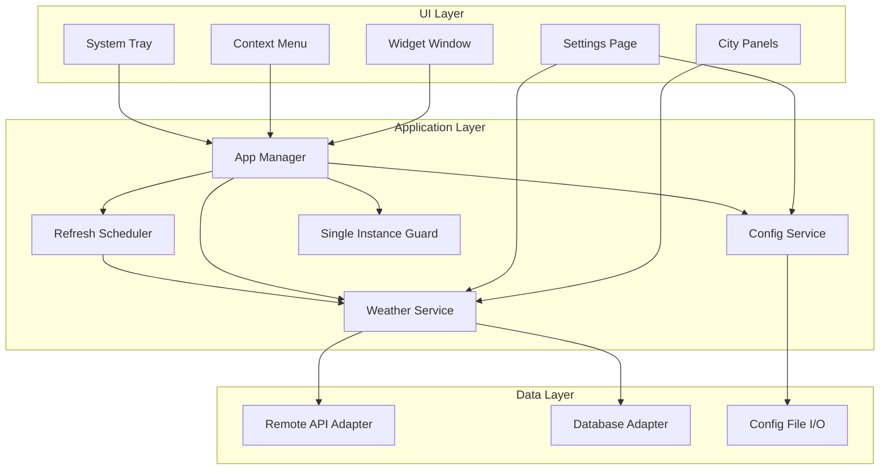
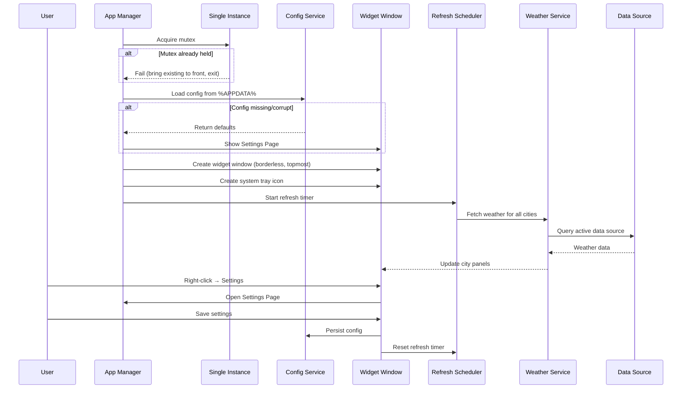

# Design Document: Windows Weather Widget

## Overview

This document describes the design for a Windows 11 desktop weather widget built as a single native Go binary. The widget renders a compact, borderless, always-on-top overlay window displaying current weather conditions for 1–3 cities side by side. Users configure cities, data sources (remote API or local PostgreSQL), and refresh intervals through a settings dialog. The application integrates with the Windows system tray and persists configuration as JSON in `%APPDATA%`.

### Key Technology Decisions

| Decision | Choice | Rationale |
|---|---|---|
| GUI Framework | [Fyne v2](https://fyne.io/) | Pure Go, cross-platform with good Windows support, device-independent pixel model, built-in widget toolkit, supports `go:embed` for assets. While Fyne doesn't natively support borderless/always-on-top windows, we use Win32 API calls via `golang.org/x/sys/windows` to apply `WS_EX_TOOLWINDOW` and `HWND_TOPMOST` styles post-creation. |
| System Tray | [fyne.io/systray](https://github.com/fyne-io/systray) or [getlantern/systray](https://github.com/getlantern/systray) | Mature Go library for cross-platform system tray with menu support. Fyne v2 has built-in system tray support via `desk.App`. |
| PostgreSQL Driver | [jackc/pgx](https://github.com/jackc/pgx) | Modern, high-performance pure-Go PostgreSQL driver with built-in connection pooling (`pgxpool`). |
| HTTP Client | `net/http` (stdlib) | Sufficient for simple REST API calls to weather services. |
| Asset Embedding | `go:embed` directive | Native Go 1.16+ feature; embeds icons, fonts, and images directly into the binary at compile time. |
| Config Format | JSON | Simple, human-readable, native Go `encoding/json` support. Stored in `%APPDATA%\WeatherWidget\config.json`. |
| Single Instance | Windows named mutex via `kernel32.dll` `CreateMutexW` | Standard Windows pattern for preventing duplicate process instances. |

## Architecture

The application follows a layered architecture with clear separation between UI, business logic, and data access.



### Component Interaction Flow



## Components and Interfaces

### 1. App Manager (`internal/app`)

Central orchestrator that initializes all components and manages the application lifecycle.

```go
type AppManager struct {
    config    *ConfigService
    weather   *WeatherService
    scheduler *RefreshScheduler
    ui        *UIManager
    guard     *SingleInstanceGuard
}

func (a *AppManager) Run() error          // Main entry point
func (a *AppManager) Shutdown()            // Graceful shutdown within 2s
```

### 2. Weather Service (`internal/weather`)

Abstracts weather data retrieval behind a common interface, supporting both remote API and local database sources.

```go
type WeatherData struct {
    CityName    string
    Region      string
    Temperature int       // Celsius, integer
    Description string    // e.g. "Partial Sunny"
    IconCode    string    // Maps to embedded icon asset
    LocalTime   time.Time // City's local timezone
    FetchedAt   time.Time
}

type WeatherProvider interface {
    FetchWeather(ctx context.Context, city CityConfig) (*WeatherData, error)
    TestConnection(ctx context.Context) error
}
```

### 3. Remote API Adapter (`internal/weather/remoteapi`)

Implements `WeatherProvider` for OpenWeatherMap and Weather Underground.

```go
type RemoteAPIAdapter struct {
    client   *http.Client
    provider string // "openweathermap" | "weatherunderground"
    apiKey   string
}

func NewRemoteAPIAdapter(provider, apiKey string) *RemoteAPIAdapter
func (r *RemoteAPIAdapter) FetchWeather(ctx context.Context, city CityConfig) (*WeatherData, error)
func (r *RemoteAPIAdapter) TestConnection(ctx context.Context) error
```

### 4. Database Adapter (`internal/weather/database`)

Implements `WeatherProvider` for local PostgreSQL.

```go
type DatabaseAdapter struct {
    pool  *pgxpool.Pool
    query string // User-configured SQL query
}

func NewDatabaseAdapter(connString, query string) (*DatabaseAdapter, error)
func (d *DatabaseAdapter) FetchWeather(ctx context.Context, city CityConfig) (*WeatherData, error)
func (d *DatabaseAdapter) TestConnection(ctx context.Context) error
func (d *DatabaseAdapter) Close()
```

### 5. Config Service (`internal/config`)

Manages loading, saving, and validating configuration.

```go
type Config struct {
    DataSource       DataSourceType   `json:"dataSource"`       // "remote_api" | "local_database"
    Cities           []CityConfig     `json:"cities"`
    RefreshInterval  int              `json:"refreshInterval"`  // minutes, 1–60, default 10
    CornerPosition   string           `json:"cornerPosition"`   // "top-left"|"top-right"|"bottom-left"|"bottom-right"
    APIConfig        *APIConfig       `json:"apiConfig,omitempty"`
    DatabaseConfig   *DatabaseConfig  `json:"databaseConfig,omitempty"`
}

type CityConfig struct {
    Name      string  `json:"name"`
    Region    string  `json:"region"`
    Latitude  float64 `json:"latitude,omitempty"`
    Longitude float64 `json:"longitude,omitempty"`
    Timezone  string  `json:"timezone"`
}

type APIConfig struct {
    Provider string `json:"provider"` // "openweathermap" | "weatherunderground"
    APIKey   string `json:"apiKey"`
}

type DatabaseConfig struct {
    Host     string `json:"host"`
    Port     int    `json:"port"`
    DBName   string `json:"dbName"`
    Username string `json:"username"`
    Password string `json:"password"`
    Query    string `json:"query"`
}

type ConfigService struct {}

func NewConfigService(appDataDir string) *ConfigService
func (c *ConfigService) Load() (*Config, error)
func (c *ConfigService) Save(cfg *Config) error
func (c *ConfigService) Validate(cfg *Config) []ValidationError
func (c *ConfigService) ConfigPath() string
func DefaultConfig() *Config
```

### 6. Refresh Scheduler (`internal/scheduler`)

Manages periodic weather data fetching with configurable intervals.

```go
type RefreshScheduler struct {
    interval time.Duration
    ticker   *time.Ticker
    weather  *WeatherService
    onUpdate func([]WeatherData)
    onError  func(city string, err error)
    stopCh   chan struct{}
}

func NewRefreshScheduler(interval time.Duration, ws *WeatherService) *RefreshScheduler
func (r *RefreshScheduler) Start()
func (r *RefreshScheduler) Stop()
func (r *RefreshScheduler) SetInterval(d time.Duration)
```

### 7. Single Instance Guard (`internal/guard`)

Prevents multiple application instances using a Windows named mutex.

```go
type SingleInstanceGuard struct {
    mutexHandle windows.Handle
}

func NewSingleInstanceGuard(name string) (*SingleInstanceGuard, error)
func (g *SingleInstanceGuard) Release() error
```

### 8. UI Manager (`internal/ui`)

Manages the Fyne application, widget window, settings dialog, and system tray.

```go
type UIManager struct {
    app        fyne.App
    widget     fyne.Window
    settings   fyne.Window
    panels     []*CityPanel
    tray       *SystemTray
}

func NewUIManager(app fyne.App) *UIManager
func (u *UIManager) ShowWidget(cities []CityConfig)
func (u *UIManager) UpdatePanels(data []WeatherData)
func (u *UIManager) ShowSettings(cfg *Config, onSave func(*Config))
func (u *UIManager) SetCorner(position string)
func (u *UIManager) ShowContextMenu()
```

### 9. City Panel (`internal/ui/panel`)

Renders weather data for a single city within the widget.

```go
type CityPanel struct {
    container   *fyne.Container
    iconWidget  *canvas.Image
    tempLabel   *widget.Label
    descLabel   *widget.Label
    cityLabel   *widget.Label
    timeLabel   *widget.Label
    errorIcon   *canvas.Image
    timeTicker  *time.Ticker
}

func NewCityPanel() *CityPanel
func (p *CityPanel) Update(data *WeatherData)
func (p *CityPanel) ShowError(stale bool)
func (p *CityPanel) StartClock(timezone string)
func (p *CityPanel) StopClock()
```

## Data Models

### Configuration File Schema

Stored at `%APPDATA%\WeatherWidget\config.json`:

```json
{
  "dataSource": "remote_api",
  "cities": [
    {
      "name": "Holambra",
      "region": "SP",
      "latitude": -22.63,
      "longitude": -47.05,
      "timezone": "America/Sao_Paulo"
    }
  ],
  "refreshInterval": 10,
  "cornerPosition": "bottom-right",
  "apiConfig": {
    "provider": "openweathermap",
    "apiKey": "abc123..."
  },
  "databaseConfig": null
}
```

### Weather Data (Internal)

```go
type WeatherData struct {
    CityName    string    `json:"cityName"`
    Region      string    `json:"region"`
    Temperature int       `json:"temperature"`
    Description string    `json:"description"`
    IconCode    string    `json:"iconCode"`
    LocalTime   time.Time `json:"localTime"`
    FetchedAt   time.Time `json:"fetchedAt"`
}
```

### Icon Mapping

Weather condition codes from the API are mapped to embedded icon assets:

| Condition | IconCode | Asset |
|---|---|---|
| Clear sky | `clear` | `assets/icons/clear.png` |
| Few clouds | `partly_cloudy` | `assets/icons/partly_cloudy.png` |
| Overcast | `cloudy` | `assets/icons/cloudy.png` |
| Rain | `rain` | `assets/icons/rain.png` |
| Snow | `snow` | `assets/icons/snow.png` |
| Thunderstorm | `storm` | `assets/icons/storm.png` |
| Fog/Mist | `fog` | `assets/icons/fog.png` |

### Validation Rules

| Field | Rule |
|---|---|
| `cities` | Length 1–3 |
| `refreshInterval` | Integer 1–60 |
| `cornerPosition` | One of: `top-left`, `top-right`, `bottom-left`, `bottom-right` |
| `apiConfig.apiKey` | Non-empty string when `dataSource` is `remote_api` |
| `apiConfig.provider` | `openweathermap` or `weatherunderground` |
| `databaseConfig.host` | Non-empty string when `dataSource` is `local_database` |
| `databaseConfig.port` | Integer 1–65535 |
| `databaseConfig.dbName` | Non-empty string |
| `databaseConfig.username` | Non-empty string |
| City name | Non-empty string |
| City coordinates | Valid lat (-90 to 90), lon (-180 to 180) when provided |


## Correctness Properties

*A property is a characteristic or behavior that should hold true across all valid executions of a system — essentially, a formal statement about what the system should do. Properties serve as the bridge between human-readable specifications and machine-verifiable correctness guarantees.*

### Property 1: Configuration serialization round-trip

*For any* valid `Config` struct, serializing it to JSON via `ConfigService.Save` and then deserializing it via `ConfigService.Load` shall produce a `Config` that is deeply equal to the original.

**Validates: Requirements 3.4, 8.1, 8.2**

### Property 2: Configuration validation correctness

*For any* `Config` struct (valid or invalid), `ConfigService.Validate` shall return a `ValidationError` for each field that violates its constraint (cities length outside 1–3, refresh interval outside 1–60, empty API key when data source is remote, port outside 1–65535 when data source is database, empty required database fields) and shall return no errors when all constraints are satisfied.

**Validates: Requirements 1.4, 4.2, 4.3, 5.2, 5.3, 6.2**

### Property 3: Corrupt configuration fallback

*For any* byte sequence that is not valid JSON or does not conform to the `Config` schema, `ConfigService.Load` shall return the default configuration without panicking or returning a partially populated struct.

**Validates: Requirements 8.3**

### Property 4: City list add preserves existing and appends

*For any* city list of length 1 or 2 and any valid `CityConfig`, appending the city shall produce a list whose length is one greater than the original, whose first N elements are identical to the original list, and whose last element is the newly added city.

**Validates: Requirements 3a.2**

### Property 5: City list remove decreases length and excludes target

*For any* city list of length 2 or 3 and any valid index within that list, removing the city at that index shall produce a list whose length is one less than the original and that does not contain the removed city.

**Validates: Requirements 3a.4**

### Property 6: City list reorder preserves set

*For any* city list and any permutation of its indices, reordering the list by that permutation shall produce a list that contains exactly the same set of cities (by identity) as the original, in the new order.

**Validates: Requirements 3a.5**

### Property 7: Widget layout dimensions

*For any* city count N in {1, 2, 3}, the widget layout calculation shall produce a total width of N × 300 device-independent pixels and a height of 120 device-independent pixels, with exactly N panel slots.

**Validates: Requirements 1.3, 1.5**

### Property 8: Weather condition to icon mapping is total

*For any* valid weather condition code returned by a `WeatherProvider`, the icon mapping function shall return a non-empty icon asset identifier that exists in the embedded asset set.

**Validates: Requirements 2.1**

### Property 9: Display string formatting

*For any* integer temperature value, `FormatTemperature` shall produce a string matching the pattern `{integer}°C`. *For any* non-empty city name and non-empty region string, `FormatCityRegion` shall produce a string equal to `"{name}, {region}"`.

**Validates: Requirements 2.2, 2.4**

### Property 10: Date/time formatting

*For any* `time.Time` value and any valid IANA timezone string, `FormatDateTime` shall produce a string matching the pattern `DD/MM/YYYY - HH:MM:SS` where DD, MM, YYYY, HH, MM, SS are the date/time components in that timezone.

**Validates: Requirements 2.5**

## Error Handling

### Data Fetch Failures

| Scenario | Behavior |
|---|---|
| Single fetch failure for a city | Display last successful `WeatherData`; show small error indicator icon on that `CityPanel`. Increment per-city failure counter. |
| 3 consecutive failures for a city | Display persistent "data may be stale" warning on that `CityPanel`. Continue retrying on schedule. |
| All cities fail | Each panel shows its own error state independently. Widget remains visible. |
| Data source switch during failure | Reset all failure counters. Begin fetching from new source immediately. |

### Configuration Errors

| Scenario | Behavior |
|---|---|
| Config file missing on startup | Load `DefaultConfig()`, open Settings Page automatically. |
| Config file corrupt/invalid JSON | Load `DefaultConfig()`, open Settings Page automatically. Log warning. |
| Config file has partial valid data | Discard entirely, load `DefaultConfig()`. Do not merge partial data. |
| Validation errors on save | Return `[]ValidationError` to UI. Do not write to disk. Settings Page highlights invalid fields. |

### Connection Errors

| Scenario | Behavior |
|---|---|
| API test request fails | Show failure notification in Settings Page with HTTP status/error message. Do not save config. |
| Database test connection fails | Show failure notification in Settings Page with connection error. Do not save config. |
| API returns unexpected response format | Log error, treat as fetch failure for that city. |
| Database query returns unexpected schema | Log error, treat as fetch failure for that city. |

### Application Lifecycle Errors

| Scenario | Behavior |
|---|---|
| Named mutex already held (second instance) | Attempt to find and foreground existing window via `FindWindow`/`SetForegroundWindow`. Terminate new process with exit code 0. |
| Shutdown exceeds 2 seconds | Force-cancel all contexts, release mutex, call `os.Exit(1)`. |
| System tray creation fails | Log warning, continue without tray. Widget remains functional via context menu. |

## Testing Strategy

### Unit Tests

Unit tests cover specific examples, edge cases, and component behavior:

- **Config Service**: Load/save with specific known configs, validation with known-invalid configs, default config structure.
- **Weather Providers**: Mock HTTP responses for API adapter, mock pgx pool for database adapter. Test response parsing, error mapping.
- **City List Operations**: Add to full list (expect rejection), remove last city (expect rejection), add with empty name (expect validation error).
- **UI Formatting**: Specific temperature values (0, -10, 100), specific city/region pairs, specific timestamps.
- **Failure Counter**: Verify error indicator after 1 failure, warning after 3 consecutive failures, counter reset after success.
- **Scheduler**: Verify timer fires, interval changes take effect, stop cancels pending ticks.

### Property-Based Tests

Property-based tests verify universal correctness properties using [rapid](https://github.com/flyingmutant/rapid) (Go PBT library).

Each property test:
- Runs a minimum of **100 iterations**
- References its design document property via tag comment
- Tag format: **Feature: windows-weather-widget, Property {number}: {property_text}**

| Property | Test Description |
|---|---|
| Property 1 | Generate random valid `Config` structs → save → load → assert deep equality |
| Property 2 | Generate random `Config` structs (valid and invalid) → validate → assert errors match exactly the violated constraints |
| Property 3 | Generate random byte sequences (including partial JSON, empty, binary) → load → assert returns `DefaultConfig()` without panic |
| Property 4 | Generate random city lists (len 1-2) + random city → append → assert length+1, last element matches, prefix unchanged |
| Property 5 | Generate random city lists (len 2-3) + random index → remove → assert length-1, removed city absent |
| Property 6 | Generate random city lists + random permutation → reorder → assert same multiset of cities |
| Property 7 | Generate random city count 1-3 → calculate layout → assert width = N×300, height = 120, slots = N |
| Property 8 | Generate random valid weather condition codes → map to icon → assert non-empty and exists in asset set |
| Property 9 | Generate random integers → format temperature → assert matches `{int}°C`; generate random name/region strings → format → assert matches `{name}, {region}` |
| Property 10 | Generate random timestamps + random IANA timezones → format → assert matches `DD/MM/YYYY - HH:MM:SS` pattern with correct values |

### Integration Tests

- **API Adapter**: Test against a local mock HTTP server returning realistic OpenWeatherMap/Weather Underground responses.
- **Database Adapter**: Test against a test PostgreSQL instance (or testcontainers) with known weather data.
- **Single Instance Guard**: Launch two processes, verify second detects mutex and exits.
- **Shutdown**: Trigger exit, verify all goroutines complete within 2 seconds.
- **System Tray**: Verify tray icon creation and menu item callbacks (Windows-only CI).
