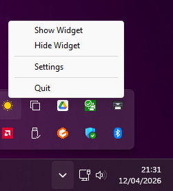
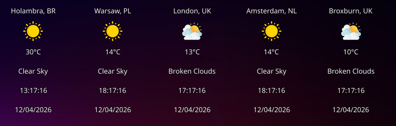
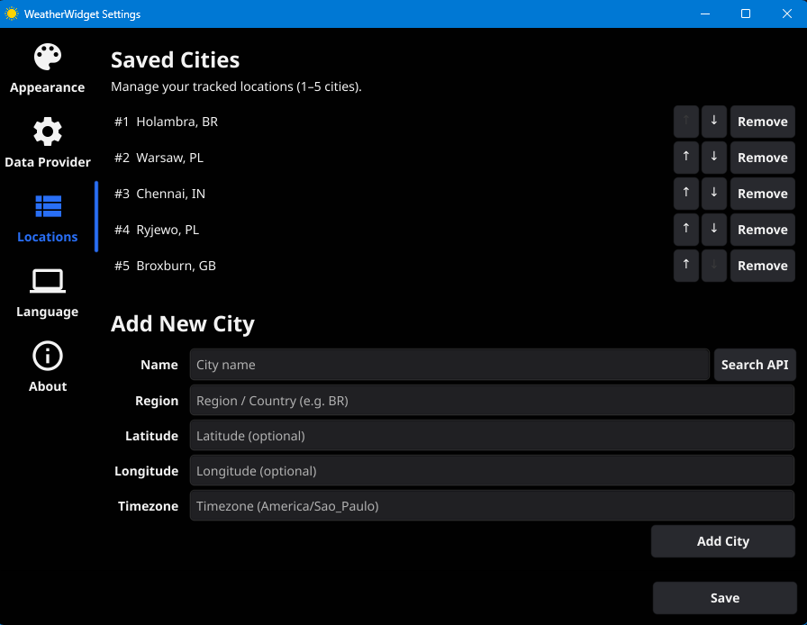
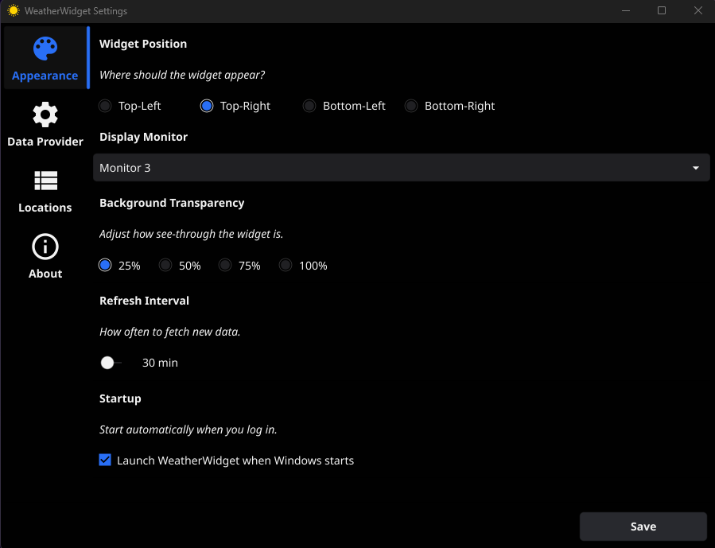
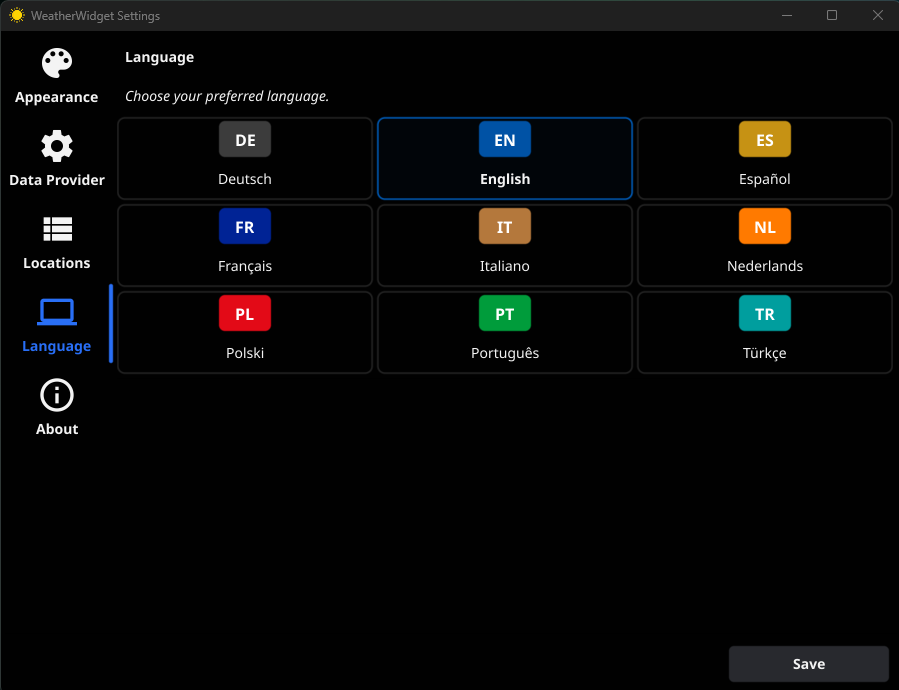

# EasyWeatherWidget

A compact weather widget for your desktop.

## Screenshots

**System Tray Menu**  



**Opacity / background transparency** - (1-5 Cities)



**Weather Widget Location Settings**  



**Weather Widget Appearance Settings**  



**Weather Widget Languages Settings**



## Download

You can download the latest pre-compiled binaries for Windows and Linux from the [GitHub Releases](https://github.com/gcclinux/WeatherWidget/releases) page.

## Compilation

### Windows
```powershell
    $env:PATH = "C:\msys64\ucrt64\bin;" + $env:PATH; $env:CGO_ENABLED = "1"; gcc --version | Select-Object -First 1
```

```powershell
    go build -ldflags="-H windowsgui -s -w" -o weatherwidget.exe ./cmd/weatherwidget/
    .\weatherwidget.exe
```

### Windows MSI Package
```powershell
 .\installer\build-msi.ps1 -Version "1.0.0" -SkipSign
 ```

### Linux
1. **Install dependencies**:
   ```bash
   sudo apt-get update && sudo apt-get install -y libgl1-mesa-dev xorg-dev
   ```
2. **Build**:
   ```bash
   make build
   ```

> **Note**: The first build may take several minutes as it compiles graphical dependencies (CGO). My updated Makefile includes the `-v` flag so you can monitor progress.

## Config example

```json
{
  "dataSource": "remote_api",
  "cities": [
    {
      "name": "Holambra",
      "region": "BR",
      "latitude": -22.6332,
      "longitude": -47.0545,
      "timezone": "America/Sao_Paulo"
    },
    {
      "name": "Edinburgh",
      "region": "UK",
      "latitude": 55.95,
      "longitude": -3.19,
      "timezone": "Europe/London"
    },
    {
      "name": "Warsaw",
      "region": "PL",
      "latitude": 52.231958,
      "longitude": 21.006725,
      "timezone": "Europe/Warsaw"
    }
  ],
  "refreshInterval": 10,
  "cornerPosition": "top-right",
  "monitorIndex": 0,
  "opacity": 25,
  "locale": "en-GB",
  "apiConfig": {
    "provider": "openweathermap",
    "apiKey": "YOUR_API_KEY"
  }
}
```

### Windows Config location

#### Windows
```powershell
type $env:APPDATA\WeatherWidget\WeatherWidget\config.json
```
#### Linux
```bash
cat $HOME/.config/WeatherWidget/WeatherWidget/config.json
```

## Troubleshooting

### "Nothing happens" when clicking Settings or Weather Panel
If the app appears in your system tray (or is running in the background) but clicking **Settings** or **Show Weather** does nothing, it usually means the application failed to create the UI window.

You can verify this by running the application from the command line with the `-debug` flag to enable logging to a file:
```powershell
.\weatherwidget.exe -debug
```
Then, check the log file at:
```powershell
type $env:APPDATA\WeatherWidget\debug.log
```

If you see the following error:
`Cause: APIUnavailable: WGL: The driver does not appear to support OpenGL`

**The Fix:**
This happens on "clean" Windows installations (using the Microsoft Basic Display Adapter) or in Virtual Machines because the system lacks proper graphics drivers to support the required OpenGL 2.0+ context.

There are two ways to fix this:
1. **Install Graphics Drivers:** Install the proper Intel/AMD/NVIDIA graphics drivers for your system.
2. **Use Mesa3D Software Renderer (Portable Fix):** If installing drivers is not an option:
   * Download a pre-compiled **Mesa3D for Windows** package (e.g., from [fdossena.com](https://fdossena.com/?p=mesa/index.frag)).
   * Extract the **64-bit `opengl32.dll`** file.
   * Place that `opengl32.dll` file directly in the same folder as your `weatherwidget.exe`. 
   
   Windows will automatically use this DLL to translate OpenGL hardware calls into software rendering, allowing the app to work flawlessly on any PC regardless of graphics drivers.

*Note: A `-software` flag is also available (`.\weatherwidget.exe -software`) which instructs the Fyne framework to prefer software rendering, but this still requires basic OpenGL driver availability at the OS level.*

## Changelog

### v0.6.3 — 2025-06-26

- Added new "heavy rain" weather icon (`heavy_rain.png`) for heavy intensity rain conditions across all providers (OWM, WU, EWW)
- Fixed weather and time display staying frozen after PC wakes from sleep/hibernation — the widget now detects system resume and triggers an immediate refresh

### v0.0.7 — 2025-07-03

- **macOS: Rounded corners** — Widget window now renders with 12pt rounded corners matching macOS design conventions
- **macOS: Window transparency** — Background transparency slider (25%/50%/75%/100%) now works on macOS using `NSWindow.alphaValue` with remapped values to keep content readable
- **macOS: Auto-start at login** — Added LaunchAgent support so the "Launch WeatherWidget when starts" setting works on macOS (creates `~/Library/LaunchAgents/com.weatherwidget.app.plist`)
- **macOS: Build script** — Added `build-darwin.sh` for one-command universal .app + .dmg creation

### v1.0.0 — 2026-07-31

- **Humidity & wind display** — Each city panel now shows humidity percentage and wind speed with compass direction (e.g. "💧 45% 💨 4.5 NW") below the weather description
- **Live settings preview** — Opacity, position, and temperature unit changes are applied to the widget in real-time as you adjust them in settings; reverts automatically if you close without saving
- **Panel Display customization** — New Widget tab in settings with checkboxes to toggle visibility of each panel element (City, Icon, Temperature, Description, Humidity & Wind, Time, Date) with a live 3-city preview
- **Dynamic panel height** — Widget window automatically resizes to fit only the visible elements when display fields are toggled
- **Live About preview** — The About tab now shows live weather data for 3 default cities with ticking clocks instead of a static screenshot
- **Windows opacity fix** — All transparency levels (25%/50%/75%/100%) now produce distinct visual results using combined LWA_COLORKEY + LWA_ALPHA
- **Settings tab reorganization** — Appearance tab renamed to Display; new Widget tab houses Panel Display and Temperature Unit with live preview
- **Modernized Locations tab** — City rows use icon buttons (move up/down/delete), bold city names, separators between entries, and coordinates grouped on a single row
- **Compact panel layout** — Reduced spacing between time/date and description/humidity rows using zero-padding layout; separator line shortened to 70% width and centered
